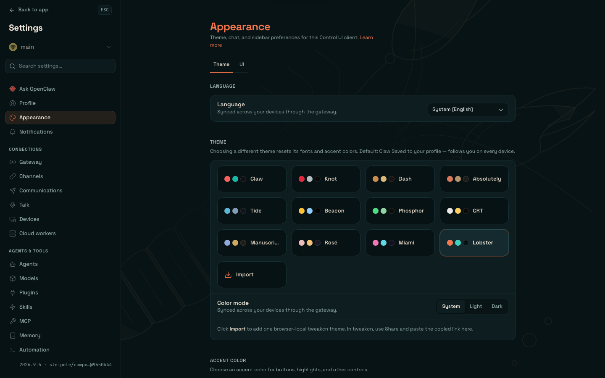
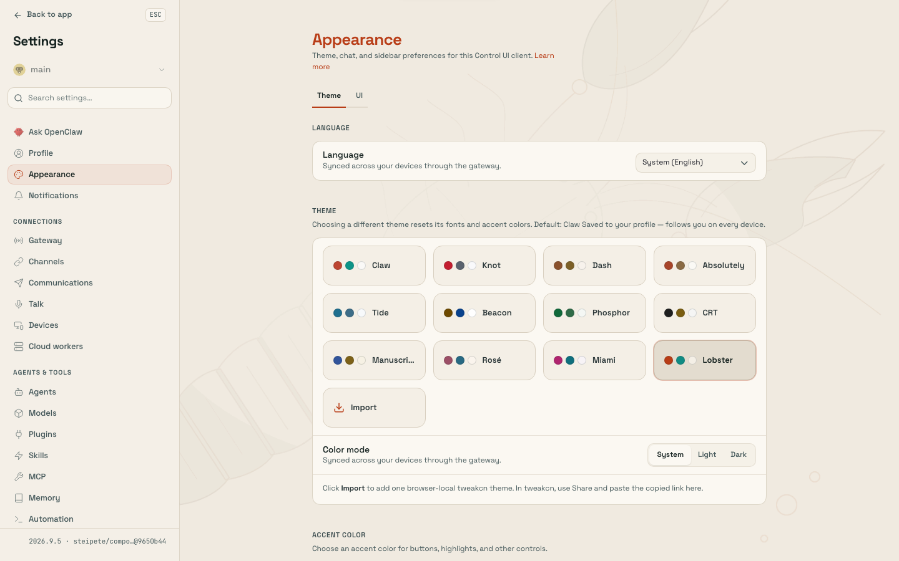

# Lobster theme

A calm, briny Lobster look for the OpenClaw Control UI. Deep-sea black-teal surfaces with warm sand text, an ember shell-orange accent, and bioluminescent teal as the second voice; the light mode is sun-bleached sand with cooked-shell red and sea-glass teal. Space Grotesk carries the controls, Fraunces the chat prose, JetBrains Mono the code. One large stylized line-art lobster runs across the canvas from the tail fan (bottom-left) to the claws (top-right), and the composer's top corners scoop inward like pincer tips.

| Dark | Light |
| --- | --- |
|  |  |

## What the theme changes

- The portable palette in `themes/lobster.json` paints every surface and works on any Gateway that lists plugin themes, without native plugin UI.
- The optional native polish (loaded only with **Settings → Labs → Custom plugin UI** enabled) is a minimal feature plugin with no operations: `src/control-ui.css` carries the hand-tuned token set with its WCAG AA audit and the pincer-tip composer rule, and `src/control-ui.ts` links Space Grotesk and Fraunces from Google Fonts (the Control UI CSP allows that origin; plugin bundles cannot carry font files) and injects the lobster background artwork, which the bundler refuses as a CSS data URL but carries as a string.
- The composer corners use `corner-shape: scoop scoop round round`. Gateways that expose `--chat-composer-corner-shape` read the same value through that token; older ones get the direct rule. Browsers without `corner-shape` keep the round corners.

## Artwork

`assets/lobster-{dark,light}.svg` are the editable sources (1600×1000, transparent, quiet center, line art with faint shell fills). Export with a 256-color palette and no dithering so the lossless WebP stays near 18 KB:

```sh
rsvg-convert -w 1600 -h 1000 -o out.png assets/lobster-dark.svg
magick out.png -dither None -colors 256 out.png
cwebp -lossless -exact -z 6 out.png -o assets/lobster-dark.webp
```

Then regenerate the base64 strings in `src/artwork.ts`.

## Install

```bash
pnpm install && pnpm build
openclaw plugins install ./plugins/lobster-theme
```

The build writes `dist/` (gitignored) and stamps the built Control UI paths into `openclaw.plugin.json`, so run it before installing from a checkout.

Select **Lobster** under Settings → Appearance, or ask the agent: "switch to the Lobster theme".
