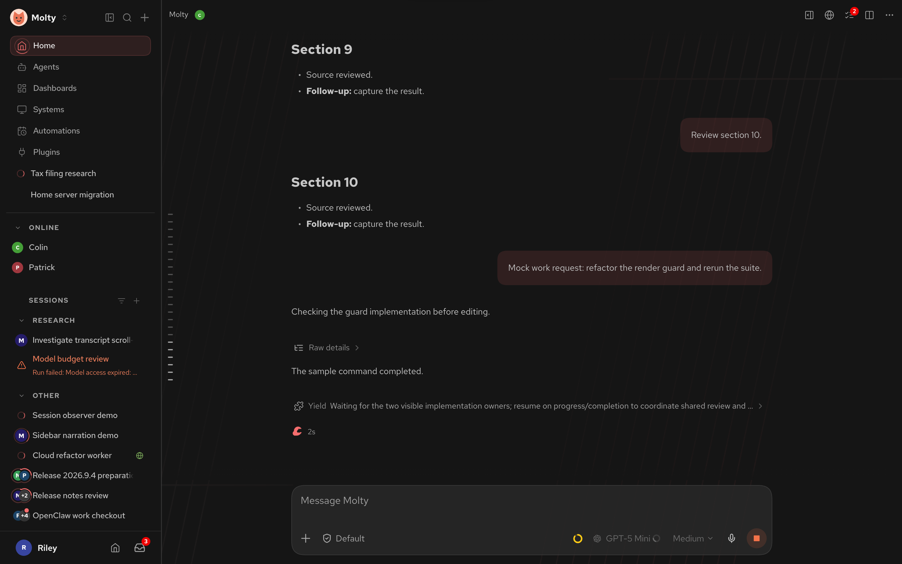
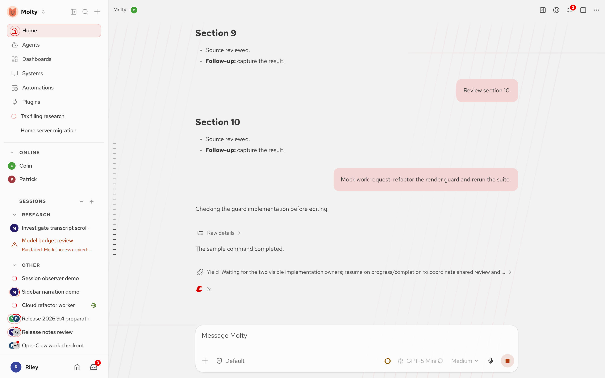

# Red Hat theme

A professional Red Hat look for the OpenClaw Control UI, following Red Hat's public [brand standards](https://www.redhat.com/en/about/brand/standards) and [design tokens](https://red-hat-design-tokens.netlify.app/): Red Hat Red `#ee0000` reserved for buttons and a single accent, neutral gray-95 through gray-10 surfaces, interaction blue as the second voice, and the Red Hat Text, Display, and Mono faces (SIL OFL). No Red Hat logo artwork is used; the theme is community work and is not affiliated with or endorsed by Red Hat, Inc.

| Dark | Light |
| --- | --- |
|  |  |

## What the theme changes

- `mascot: "none"`: the lobster stays home. The sidebar mark, favicon, working row, and system avatar use a neutral prompt-style mark in the theme's primary color.
- `workingPhrases`: long-running turns rotate through build-and-deploy words (Building, Compiling, Provisioning, Orchestrating, Deploying, …) instead of the crustacean ones.
- `critters: ["penguin", "fedora"]`: a penguin in a red fedora and the hat on its own join the composer ledge traffic next to the crab, snail, duck, and jellyfish. The **Lobster visits** toggle still governs all visitors.
- `avatarHat: "fedora"`: about one page load in six, an agent avatar wears a red fedora.

These fields are part of the portable theme definition, so the theme works without any native plugin UI. The optional `src/control-ui.css` polish (loaded only with **Settings → Labs → Custom plugin UI** enabled) adds the self-declared Red Hat faces from Google Fonts, the hand-tuned token set with its WCAG AA audit, and the 12° hairline background artwork.

## Requirements

The `mascot`, `workingPhrases`, `critters`, and `avatarHat` fields need an OpenClaw Gateway that includes the portable theme extension (openclaw/openclaw, September 2026). Older gateways reject the definition with a plugin diagnostic and keep the rest of the plugin inert.

## Install

```bash
pnpm install && pnpm build
openclaw plugins install ./plugins/redhat-theme
```

Select **Red Hat** under Settings → Appearance, or ask the agent: "switch to the Red Hat theme".
